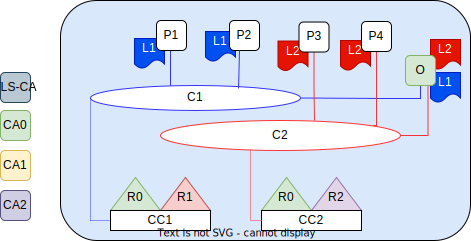

# ChainVote documentation

This document presents the general architecture and the main concepts of the project. 

## Network architecture

Three main organizations:

- One will contain only orderer nodes (org0)
- One will maintain the vote-collecting functionality + code management (org1)
- One will maintain the general information of the elections (org2)

Org1 and Org2 are both composed of two peers while Org0 contains 3 orderer nodes. 

### Data Structures

#### Election data -> org1

- Election name
- Election starting date / ending date
- Election choices
- (Maximum voters number)

#### Code generation (for each election) -> org2

Code generation is done at the time they are requested

#### User - Code relationship -> org2

- UserID, is an off-chain information given by a (simulated?) authentication system
- Code generated before

#### Vote data -> org1

- VotingID
- Choice

#### User authentication -> off chain

- Name
- Surname
- Email (username)
- Password
- (Role?)

## Architectural design

## SC (chaincodes) design

### Code management design

## References

- [Blockchain for electronic voting system - Review and Open Research Challenges](https://www.ncbi.nlm.nih.gov/pmc/articles/PMC8434614/)
- [Decentralized electronic voting system using Hyperledger Fabric](https://ieeexplore.ieee.org/document/9860211)
- [E-Voting System Using Hyperledger Fabric Blockchain and Smart Contracts](https://www.mdpi.com/2673-4591/7/1/11)
- [Assuring Anonymity and Privacy in Electronic Voting with Distributed Technologies Based on Blockchain](https://www.mdpi.com/2076-3417/12/11/5477)
