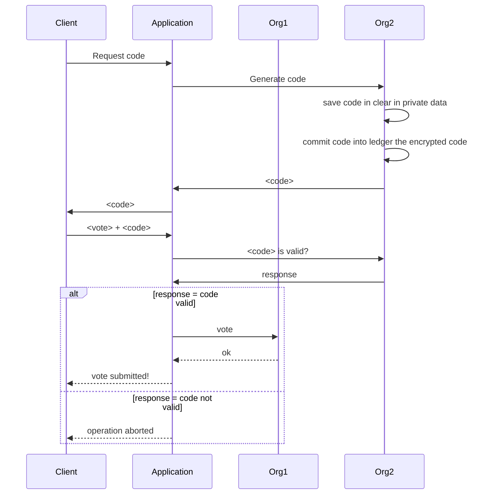

# ChainVote documentation

## Architecture
The document presents the general architecture and the main concepts of the project. 

### Network architecture
In order to guarantee the properties of accountability and anonymity of users we decide to split the blockchain in 2 main functionalities, the first one that collects the results, and the second one as support to provide verifiability, authorizing authenticated users to vote, if specified policies (e.g. the vote occurs when the votation is open) are verified, once and storing the encrypted vote.

Hyperledger Fabric is used as core blockchain technology. In this are defined three main organizations:

- One will contain only orderer nodes (org0)
- One will maintain the vote-collecting functionality (org1)
- One will be used to authorize authenticated users to vote (org2)

org1 and org2 are both composed of two peers while org0 will maintain only a single orderer. 

## References  

- [Blockchain for electronic voting system - Review and Open Research Challenges](https://www.ncbi.nlm.nih.gov/pmc/articles/PMC8434614/)
- [Decentralized electronic voting system using Hyperledger Fabric](https://ieeexplore.ieee.org/document/9860211)
- [E-Voting System Using Hyperledger Fabric Blockchain and Smart Contracts](https://www.mdpi.com/2673-4591/7/1/11)
- [Assuring Anonymity and Privacy in Electronic Voting with Distributed Technologies Based on Blockchain](https://www.mdpi.com/2076-3417/12/11/5477)
